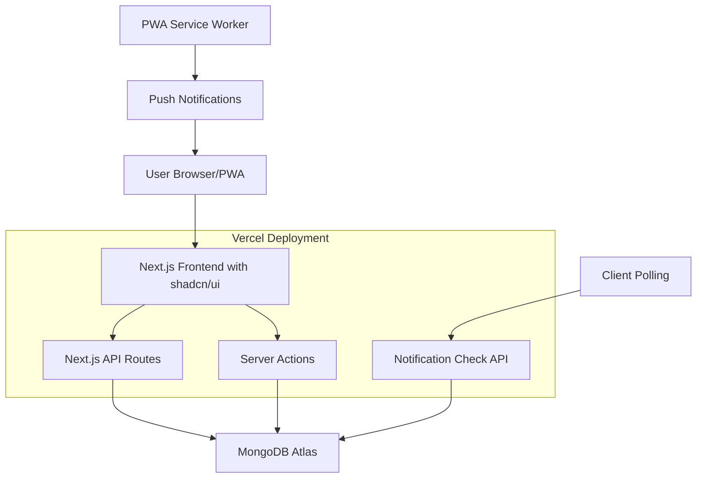
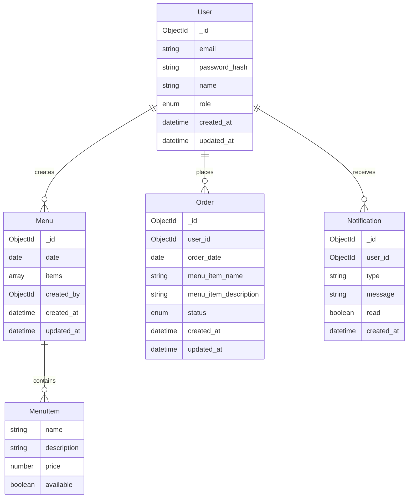

# Design Document

## Overview

The Daily Lunch Ordering System is a full-stack web application built with Next.js 14, MongoDB, and deployed on Vercel. The system provides user authentication, role-based access control, daily menu management, automated notifications, and order processing capabilities. The architecture leverages Next.js App Router, server actions, and API routes for a modern, performant application that fits within free tier hosting limits.

## Architecture

### Technology Stack

- **Frontend**: Next.js 14 with App Router, React 18, Tailwind CSS
- **Backend**: Next.js API Routes and Server Actions
- **Database**: MongoDB Atlas (Free Tier - 512MB)
- **Authentication**: NextAuth.js v5 with MongoDB adapter
- **Deployment**: Vercel (Free Tier)
- **Notifications**: In-app notifications only with client-side polling + PWA notifications
- **UI Components**: shadcn/ui component library with Tailwind CSS
- **Scheduling**: Simple database-based cron simulation (no external dependencies)

### System Architecture



### Database Design



## Components and Interfaces

### Frontend Components

_All components built using shadcn/ui component library with Tailwind CSS_

#### Authentication Components

- `LoginForm`: Email/password login with validation using shadcn/ui Form, Input, and Button components
- `SignupForm`: User registration with email verification using shadcn/ui Form components
- `AuthProvider`: Context provider for authentication state

#### User Interface Components

- `Dashboard`: Main landing page using shadcn/ui Card, Badge, and Button components
- `MenuDisplay`: Daily menu display using shadcn/ui Card, Badge, and Separator components
- `OrderForm`: Order interface using shadcn/ui Form, Select, and Button components
- `NotificationBell`: Notification indicator using shadcn/ui Badge and Popover components
- `UserProfile`: User settings using shadcn/ui Form, Input, and Card components

#### Admin Interface Components

- `AdminDashboard`: Admin overview using shadcn/ui Dashboard layout, Cards, and Charts
- `MenuManager`: Menu management using shadcn/ui Form, Table, and Dialog components
- `OrdersView`: Order processing using shadcn/ui Table, Badge, and Export functionality
- `UserManager`: User role management using shadcn/ui Table, Select, and Dialog components
- `NotificationCenter`: Admin notifications using shadcn/ui Card, Badge, and List components

### API Interfaces

#### Authentication Endpoints

```typescript
// /api/auth/[...nextauth]/route.ts
POST / api / auth / signin;
POST / api / auth / signup;
GET / api / auth / session;
POST / api / auth / signout;
```

#### Menu Management

```typescript
// /api/menu/route.ts
GET /api/menu?date=YYYY-MM-DD
POST /api/menu (admin only)
PUT /api/menu (admin only)
DELETE /api/menu (admin only)
```

#### Order Management

```typescript
// /api/orders/route.ts
GET /api/orders?date=YYYY-MM-DD
POST /api/orders
PUT /api/orders/:id
DELETE /api/orders/:id

// /api/admin/orders/route.ts
GET /api/admin/orders?date=YYYY-MM-DD (admin only)
POST /api/admin/orders/process (admin only)
```

#### User Management

```typescript
// /api/admin/users/route.ts
GET /api/admin/users (superuser only)
PUT /api/admin/users/:id/role (superuser only)
```

#### Notifications

```typescript
// /api/notifications/route.ts
GET /api/notifications
PUT /api/notifications/:id/read
POST /api/notifications/send (system only)
```

### Server Actions

```typescript
// app/actions/orders.ts
async function createOrder(formData: FormData);
async function updateOrder(orderId: string, formData: FormData);
async function deleteOrder(orderId: string);

// app/actions/menu.ts
async function createMenu(formData: FormData);
async function updateMenu(menuId: string, formData: FormData);

// app/actions/admin.ts
async function processOrders(date: string);
async function updateUserRole(userId: string, role: string);
```

## Data Models

### User Model

```typescript
interface User {
  _id: ObjectId;
  email: string;
  password: string; // hashed
  name: string;
  role: "user" | "admin" | "superuser";
  createdAt: Date;
  updatedAt: Date;
}
```

### Menu Model

```typescript
interface Menu {
  _id: ObjectId;
  date: Date;
  items: MenuItem[];
  createdBy: ObjectId;
  createdAt: Date;
  updatedAt: Date;
}

interface MenuItem {
  name: string;
  description: string;
  price?: number;
  available: boolean;
}
```

### Order Model

```typescript
interface Order {
  _id: ObjectId;
  userId: ObjectId;
  orderDate: Date;
  menuItemName: string;
  menuItemDescription: string;
  status: "pending" | "confirmed" | "cancelled";
  createdAt: Date;
  updatedAt: Date;
}
```

### Notification Model

```typescript
interface Notification {
  _id: ObjectId;
  userId?: ObjectId; // null for system-wide notifications
  type:
    | "order_reminder"
    | "order_confirmed"
    | "order_modified"
    | "menu_updated";
  message: string;
  read: boolean;
  createdAt: Date;
}
```

## Error Handling

### Client-Side Error Handling

- Form validation with Zod schemas
- Toast notifications for user feedback
- Error boundaries for component-level errors
- Loading states and skeleton components

### Server-Side Error Handling

```typescript
// utils/error-handler.ts
class AppError extends Error {
  statusCode: number;
  isOperational: boolean;

  constructor(message: string, statusCode: number) {
    super(message);
    this.statusCode = statusCode;
    this.isOperational = true;
  }
}

// Centralized error handling middleware
function handleError(error: Error, req: Request, res: Response) {
  if (error instanceof AppError) {
    return res.status(error.statusCode).json({
      status: "error",
      message: error.message,
    });
  }

  // Log unexpected errors
  console.error("Unexpected error:", error);
  return res.status(500).json({
    status: "error",
    message: "Something went wrong",
  });
}
```

### Database Error Handling

- Connection retry logic
- Graceful degradation for read operations
- Transaction rollback for critical operations
- Proper indexing for performance

## Testing Strategy

### Unit Testing

- **Framework**: Vitest + React Testing Library
- **Coverage**: Components, utilities, and server actions
- **Mocking**: Database operations and external services

### Integration Testing

- **API Routes**: Test all endpoints with different user roles
- **Database Operations**: Test CRUD operations with test database
- **Authentication Flow**: Test login/signup/logout processes

### End-to-End Testing

- **Framework**: Playwright
- **Scenarios**:
  - User registration and login
  - Menu viewing and ordering
  - Admin menu management
  - Order processing workflow
  - Notification delivery

### Performance Testing

- **Lighthouse**: Core Web Vitals monitoring
- **Load Testing**: API endpoint performance
- **Database Queries**: Query optimization and indexing

## Deployment and Infrastructure

### Vercel Configuration

```javascript
// next.config.js - No special Vercel configuration needed
/** @type {import('next').NextConfig} */
const nextConfig = {
  experimental: {
    serverComponentsExternalPackages: ["mongoose"],
  },
};

module.exports = nextConfig;
```

### Environment Variables

```bash
# Authentication
NEXTAUTH_SECRET=
NEXTAUTH_URL=

# Database
MONGODB_URI=

# Superuser
SUPERUSER_EMAIL=sanjay@complyance.io
```

### MongoDB Atlas Setup

- **Cluster**: M0 Sandbox (Free Tier)
- **Storage**: 512MB limit
- **Connections**: 100 concurrent connections
- **Indexes**: Optimized for common queries
- **Backup**: Automated daily backups

### Notification System

- **Daily Reminders**: Database-based scheduling with API route checks (no external cron needed)
- **In-App Notifications**: Client-side polling every 30 seconds when app is active
- **PWA Push Notifications**: Browser notifications when app is installed as PWA on mobile
- **Scheduling Logic**: Check time on each API call, trigger notifications when 10:30 AM weekdays
- **Mobile Support**: PWA notifications work on mobile browsers when site is added to home screen

## Security Considerations

### Authentication Security

- Password hashing with bcrypt
- JWT tokens with secure httpOnly cookies
- Session management with NextAuth.js
- Rate limiting on authentication endpoints

### Authorization

- Role-based access control (RBAC)
- Route protection with middleware
- API endpoint authorization checks
- Superuser-only operations protection
- **Important**: All users (including admins and superusers) can place food orders - administrative roles are additive permissions

### Data Security

- Input validation and sanitization
- SQL injection prevention (NoSQL injection)
- XSS protection with Content Security Policy
- HTTPS enforcement in production

### Free Tier Limitations

- **Vercel**: 100GB bandwidth, 1000 serverless function invocations
- **MongoDB Atlas**: 512MB storage, 100 connections
- **Resend**: 10,000 emails/month, 100 emails/day
- **Monitoring**: Basic error tracking and performance metrics
